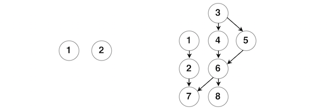
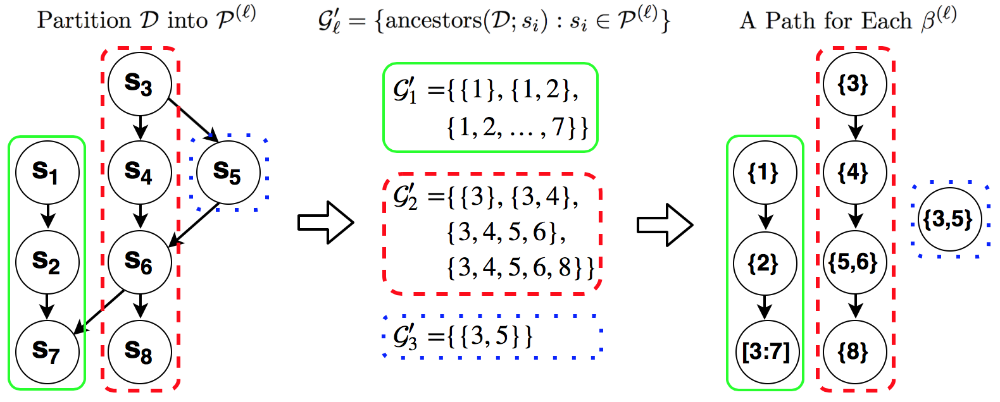

The `hsm` package implements an algorithm utilizing BCD blocked by path 
graphs for solving proximal operator of latent group Lasso in 
hierarchical sparse modeling, that is described in [Yan & Bien (2015) 
``Hierarchical Sparse Modeling: A Choice of Two Regularizers''](https://arxiv.org/pdf/1512.01631v1.pdf). This document 
introduces how to use this package.

## Knowing what problem is solved here
The solved problem is proximal operator of latent group lasso
$$
\begin{aligned}
&\min_{\beta\in\mathbb R^p}\frac{1}{2}\left\|y - \beta  \right\|_2^2 + \lambda
*\Omega_{latent}^{\mathcal G}(\beta;w)\\
\text{where }&\Omega_{latent}^{\mathcal G}(\beta;w) = \min_{\substack{
supp(v^{(g)})\subset g, \text{ for }g\in\mathcal G\\\sum_{g\in\mathcal G}v^{(g)}=\beta}} w_g\left\|v^{(g)}\right\|_2
\end{aligned}
$$
for which the set of groups $\mathcal G$ are constructed so that a **hierarchical 
sparsity pattern** can be achieved in the solution. More specifically, for parameter
of interest $\beta$, we define sets $s_1, \dots, s_{n.nodes}\subset[1:p]$ such that
$s_i\cap s_j=\emptyset$ for $i\neq j$ and $s_i\neq\emptyset$ for all $i\in[1:n.nodes]$.
A directed acyclic graph (DAG) defined on $\{s_1,\dots,s_{n.nodes}\}$ encodes 
the desired hierarchical structure in that when we set $\beta_{s_i}$ to zero, we 
have 
$$\beta_{s_i}=0\quad\Rightarrow\quad\beta_{s_j}=0\quad\text{if }s_i\in ancestor(s_j)$$
where $ancestor(s_j)=\{s_k:s_k\text{ is in an ancestor node of }s_j,k\in[1:n.nodes]\}$. 
The details of $\mathcal G$ can be found in Section 2.2 of Yan & Bien (2015). 

In short, if you have a parameter vector $\beta$ embedded in a DAG *and* you 
desire the support to be parameters embedded in the a top portion of the DAG, 
solving the problem here can accomplish the goal of parameter selection. In 
addition, the solver can be used as a core step in a collection of proximal 
gradient methods including [ISTA and FISTA](http://mechroom.technion.ac.il/~becka/papers/71654.pdf). Please pay 
attention to the two requirements on DAG specified above:

* No two nodes shall share common parameters ($s_i\cap s_j=\emptyset$);
* There is no empty node in DAG ($s_i\neq\emptyset$).

Making sure the requirements satisfied are essential to the successful run of 
the package.

### Inputs for functions
There are two main functions in the package: `hsm` and `hsm.path`. The 
difference between them is that `path` solves the problem for a single $\lambda$ 
value, while `hsm.path` does that over a grid of $\lambda$ values. Besides 
the inputs for $\lambda$, these two functions share the same inputs. For the 
functions to work, you need to provide either `map` and `var`, or `assign` and 
`w.assign`. Generally, `map` and `var` are easier to define, and if provided they
will be used to compute `assign` and `w.assign`. Meanwhile, the construction of 
`assign` and `w.assign` are related to the decomposition of DAG, which we will 
discuss in the next section. The following two examples show how to define 
`map` and `var` based on DAG and $\beta$.



1. **Example 1**: The DAG contains two nodes on the left panel of the above 
figure. There are no directed edges connecting the two nodes. Suppose 
$\beta\in\mathbb R^{10}$ such that $\beta_1$ through $\beta_{10}$ are embedded in 
Node $1$ and the rest are embedded in Node $2$. The inputs we have for this DAG 
is as the following.
```{r}
map <- matrix(c(1, NA, 2, NA), ncol = 2, byrow = TRUE)
map
var <- list(1:10, 11:20)
var
```

2. **Example 2**: The DAG is on the right panel of the above figure. Suppose 
$\beta\in\mathbb R^8$ and $\beta_i$ is embedded in Node $i$ for $i\in [1:8]$. 
The inputs we have for this DAG is as the following.
```{r}
map <- matrix(c(1, 2, 2, 7, 3, 4, 4, 6, 6, 7, 6, 8, 3, 5, 5, 6), 
  ncol = 2, byrow = TRUE)
map 
var <- as.list(1:8)
var
```

Another argument requiring more attention is the weight vector for groups in 
$\mathcal G$. Since groups in $\mathcal G$ are one-one correspondence to the 
nodes in DAG, the elements in `w` should be of the same order as the indices for 
nodes. Under default value `NULL` for `w`, `hsm` and `hsm.path` will use 
$w_l=\sqrt{\left|g_l\right|}$ as the weight applied to group $g_l$. If you 
choose to pass in values for `w` yourself, you need to make sure $w_l$ 
increases with the size of $g_l$, i.e., if $\left|g_{l_1}\right | > \left|g_{l_2}\right |$, $w_{l_1}> w_{l_2}$; otherwise, the functions 
will fail.

## Descrbing how the package works
Prior to `hsm`, an intuitive and commonly-used way to solve the proximal 
operator is running BCD across groups in $\mathcal G$ as described in Section 
4.1 of the paper. That approach can be computationally intensive, given the 
number of groups in $\mathcal G$ can be large and convergence is slow. Our 
path-based BCD takes advantage of the fact that the proximal operator can be 
exactly solved if all the parameters are embedded in a path graph, which is 
the finding in Section 4.2 of the paper. To work, `hsm` breaks down DAG 
into non-overlapping path graphs and runs BCD over parameters across the path 
graphs. For more details, see Section 4.2 and 4.3 of the paper. 
The number of path graphs is no larger than the number of nodes (in many 
cases, the difference is considerably large), which allows `hsm` to update 
more parameters per cycle and to enjoy better convergence rate.

### Breaking down DAG into path graphs
We use Example 2 to show how `hsm` breaks down a DAG.
In the DAG of Example 2, there are two root nodes: Node 1 and Node 3. 
All the nodes in the DAG are descendants of at least one of the root nodes. At
every root, `hsm` finds all possible path graphs originated from 
that root, picks up the one that consists of the most unmarked nodes, and marks
the nodes in the selected path graphs. `hsm` will move to the next root only
after all the descendant nodes of the current root have been marked. In Example 2, `hsm` is initially at Node 1. Since there is only one path graph
consisting of nodes $\{1, 2, 7\}$ originated from 1, `hsm` selects it and 
mark nodes $\{1,2,7\}$. Then, `hsm` moves to the next root which is Node 3. 
There are four path graphs originated from Node 3: $\{3,4,6,7\}$, $\{3,4,6,8\}$, 
$\{3,5,6,7\}$ and $\{3,5,6,8\}$. Both $\{3,4,6,8\}$ and $\{3,5,6,8\}$ have 4 
unmarked nodes. Under a tie situation, `hsm` picks up the first one and 
marks $\{3,4,6,8\}$. Now only one node is left unmarked, so Node 5 will be a path 
graph by itself. 



The above figure shows the decomposition of DAG in Example 2 (suppose $s_i=\{i\}$ for $i=1, \cdots, 8$ in the left panel). On the left panel, 
the three colored contours correspond to the three generated path graphs. Given 
we assume Node $i$ only contains parameter $\beta_i$ in this example, we are able
to show the embedded parameters in the three path graphs in the right panel. The 
example is more throughly explained in Figure 7 of the paper. In the package, 
the function `paths` performs the decomposition of DAG and generates `assign` and 
`w.assign`.

```{r}
library(hsm)
map <- matrix(c(1, 2, 2, 7, 3, 4, 4, 6, 6, 7, 6, 8, 3, 5, 5, 6), 
  ncol = 2, byrow = TRUE)
var <- as.list(1:8)
paths(map, var)
```


## Getting solutions along the solution path
The functiont `hsm` takes the input `y` and returns a solution to the 
proximal operator, $\hat\beta$. The sparsity level of $\hat\beta$ depends on 
the magnitude of the tuning parameter $\lambda$. The function `hsm.path` 
gets $\hat \beta$ along a (log-linear) grid of $\lambda$ values. By default, a 
grid is used that starts at a value of $\lambda$ for which $\hat\beta$ is a zero
vector. Users may supply this grid of $\lambda$ values using the argument 
`lamlist`.

Following the specification in Example 2, the solutions along the solution path 
is
```{r results='hide'}
library(hsm)
map <- matrix(c(1, 2, 2, 7, 3, 4, 4, 6, 6, 7, 6, 8, 3, 5, 5, 6), 
  ncol = 2, byrow = TRUE)
var <- as.list(1:8)
set.seed(100)
y <- rnorm(8)
result.path <- hsm.path(y=y, map=map, var=var, get.penalval=TRUE)
```
 
Let's look at $\hat\beta$ generated.
```{r}
round(result.path$beta.m, digits = 4)
```

By adjusting `flmin` (which is the ratio between the largest and smallest 
$\lambda$ values in the grid) and `nlam` (which is the number of grid points used), 
you can get your desired sparsity level in the solutions.

